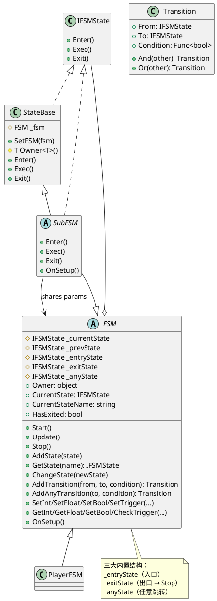

# FSM 状态机模块

轻量级有限状态机，支持分层子状态机（SubFSM）、参数驱动转换、Any State 跳转。

---

## 1. 架构概览

### 1.1 类图



### 1.2 执行流程

```mermaid
flowchart TD
    A[Start] --> B[ChangeState Entry]
    B --> C[_currentState Enter]

    C --> D{per-frame Update}

    D --> E[_anyState 转换 OK?]
    E -->|yes| F[ChangeState To]
    E -->|no| G[_currentState 转换 OK?]
    G -->|yes| F
    G -->|no| H[_currentState Exec]

    F --> I[prev Exit -> next Enter]
    I --> D

    H --> D

    J[Stop] --> K[_currentState Exit]
    K --> L[_currentState null]
    L --> M[HasExited true]
@enduml
```

---

## 2. 快速开始

### 2.1 定义状态

继承 `StateBase`：

```csharp
public class PlayerIdleState : StateBase
{
    public override void Enter()
    {
        Debug.Log($"{Owner<Player>().name} 进入待机");
    }

    public override void Exec()
    {
        // 每帧检查输入
        if (_fsm.GetBool("isMoving"))
            return;
    }

    public override void Exit()
    {
        Debug.Log($"{Owner<Player>().name} 离开待机");
    }
}
```

### 2.2 定义状态机

继承 `FSM`，覆盖 `OnSetup` 添加状态和转换：

```csharp
public class PlayerFSM : FSM
{
    public PlayerFSM(Player player) : base(player) { }

    protected override void OnSetup()
    {
        AddState(new PlayerIdleState());
        AddState(new PlayerMoveState());
        AddState(new PlayerAttackState());

        AddTransition(GetState("PlayerIdleState"), GetState("PlayerMoveState"),
            () => GetBool("isMoving"));
        AddTransition(GetState("PlayerMoveState"), GetState("PlayerIdleState"),
            () => !GetBool("isMoving"));

        AddAnyTransition(GetState("PlayerHurtState"),
            () => GetBool("isHurt"));
    }
}
```

### 2.3 外部驱动

```csharp
var fsm = new PlayerFSM(player);
fsm.Start();

void Update()
{
    fsm.SetBool("isMoving", Input.GetKey(KeyCode.W));
    fsm.Update();
}
```

---

## 3. 状态接口 — `IFSMState`

| 方法 | 调用时机 | 用途 |
|------|----------|------|
| `Enter()` | 状态被激活时 | 初始化、播放动画 |
| `Exec()` | 每帧 | 持续行为、主动修改参数 |
| `Exit()` | 状态退出时 | 清理、停止动画 |

---

## 4. 状态基类 — `StateBase`

| 成员 | 类型 | 说明 |
|------|------|------|
| `_fsm` | `protected FSM` | 所属状态机引用（自动注入） |
| `Owner<T>()` | `protected T` | 泛型获取持有者对象 |

```csharp
public class AttackState : StateBase
{
    public override void Enter()
    {
        var player = Owner<Player>();
        player.PlayAnimation("Attack");
    }
}
```

---

## 5. 转换条件 — `Transition`

### 5.1 基础用法

```csharp
AddTransition(from, to, () => _fsm.GetBool("isMoving"));
```

### 5.2 组合条件

```csharp
// And：同时满足
AddTransition(from, to, () => _fsm.GetBool("isMoving"))
    .And(() => _fsm.GetFloat("distance") > 5f);

// Or：满足任一
AddTransition(from, to, () => _fsm.GetBool("isDead"))
    .Or(() => _fsm.GetBool("forceExit"));
```

### 5.3 Any State

从任意状态都可触发，适合全局中断：

```csharp
AddAnyTransition(to, () => _fsm.GetBool("isStunned"));
AddAnyTransition(to, () => _fsm.GetBool("isDead"));
```

---

## 6. FSM API 参考

### 6.1 生命周期

| 方法 | 说明 |
|------|------|
| `Start()` | 启动，从 Entry 开始 |
| `Update()` | 每帧调用：检查 Any → 检查当前 → Exec |
| `Stop()` | 停止，`HasExited = true` |

### 6.2 状态管理

| 方法 | 说明 |
|------|------|
| `AddState(state)` | 注册状态（按类型名索引，自动注入 fsm） |
| `GetState(name)` | 按类型名查找状态，不存在返回 null |

### 6.3 状态跳转

| 方法 | 说明 |
|------|------|
| `ChangeState(state)` | 切换到指定状态 |
| `GotoEntry()` | 切换回 Entry |

### 6.4 转换配置

| 方法 | 说明 |
|------|------|
| `AddTransition(from, to, condition)` | 从 from 到 to 的转换条件，返回 Transition |
| `AddAnyTransition(to, condition)` | 任意状态到 to 的转换，返回 Transition |

### 6.5 参数管理

| 方法 | 说明 |
|------|------|
| `SetInt(name, value)` | 设置整数参数 |
| `GetInt(name)` | 获取整数，不存在返回 0 |
| `SetFloat(name, value)` | 设置浮点数参数 |
| `GetFloat(name)` | 获取浮点数，不存在返回 0f |
| `SetBool(name, value)` | 设置布尔参数 |
| `GetBool(name)` | 获取布尔，不存在返回 false |
| `SetTrigger(name)` | 设置触发器（一次性） |
| `CheckTrigger(name)` | 检查并重置触发器 |

### 6.6 属性

| 属性 | 类型 | 说明 |
|------|------|------|
| `Owner` | `object` | 持有者对象 |
| `CurrentState` | `IFSMState` | 当前状态实例 |
| `CurrentStateName` | `string` | 当前状态的类型名 |
| `HasExited` | `bool` | 是否已 Stop |

| 属性 | 类型 | 说明 |
|------|------|------|
| `Owner` | `object` | 持有者对象 |
| `CurrentState` | `IFSMState` | 当前状态实例 |
| `CurrentStateName` | `string` | 当前状态的类型名 |
| `HasExited` | `bool` | 是否已 Stop |

### 6.7 构造与配置

| 方法 | 说明 |
|------|------|
| `OnSetup()` | 配置状态和转换（抽象方法，子类必须实现） |

---

## 7. 子状态机 — `SubFSM`

SubFSM 继承 FSM 实现 IFSMState，作为状态嵌入父 FSM。**共享父的参数字典**，进入时自动调用 `OnSetup`。

### 7.1 结构图

```mermaid
flowchart TB
    subgraph 父FSM
        PIdle["IdleState"]
        PCombat["CombatSubFSM"]
    end

    subgraph CombatSubFSM
        CIdle["SubIdleState"]
        CAttack["SubAttackState"]
        CIdle -->|isAttacking| CAttack
        CAttack -->|exitCombat| CIdle
    end

    PIdle -->|inCombat| PCombat
    PCombat -->|子Stop| PIdle
@enduml
```

SubFSM 继承 FSM 实现 IFSMState，作为状态嵌入父 FSM。**共享父的参数字典**，进入时自动调用 `OnSetup`。

### 7.2 用法

```csharp
// 父状态机
public class PlayerFSM : FSM
{
    protected override void OnSetup()
    {
        AddState(new PlayerIdleState());
        AddState(new CombatSubFSM(this));

        AddTransition(GetState("PlayerIdleState"), GetState("CombatSubFSM"),
            () => GetBool("inCombat"));
    }
}

// 子状态机
public class CombatSubFSM : SubFSM
{
    public CombatSubFSM(FSM parent) : base(parent) { }

    protected override void OnSetup()
    {
        AddState(new SubIdleState());
        AddState(new SubAttackState());

        // Entry -> 第一个状态
        AddTransition(_entryState, GetState("SubIdleState"), () => true);

        AddTransition(GetState("SubIdleState"), GetState("SubAttackState"),
            () => GetBool("isAttacking"));
        AddTransition(GetState("SubAttackState"), GetState("SubIdleState"),
            () => GetBool("exitCombat"));
    }
}
```

### 7.3 子退出行为

子状态机 `Stop` 时，自动通知父切换回**进入前的那个状态**。无需手动处理。

### 7.4 适用场景

- 玩家状态机中的"战斗子状态机"
- 敌人 AI 中的"移动子状态机"

---

## 8. 完整示例

```csharp
public class Player
{
    private readonly PlayerFSM _fsm;

    public Player()
    {
        _fsm = new PlayerFSM(this);
        _fsm.Start();
    }

    public void Update()
    {
        _fsm.SetBool("isMoving", Input.GetKey(KeyCode.W));
        _fsm.Update();
    }
}

public class PlayerFSM : FSM
{
    public PlayerFSM(Player player) : base(player) { }

    protected override void OnSetup()
    {
        AddState(new PlayerIdleState());
        AddState(new PlayerMoveState());
        AddState(new PlayerHurtState());
        AddState(new CombatSubFSM(this));

        // Entry -> 第一个状态
        AddTransition(_entryState, GetState("PlayerIdleState"), () => true);

        // Idle <-> Move
        AddTransition(GetState("PlayerIdleState"), GetState("PlayerMoveState"),
            () => GetBool("isMoving"));
        AddTransition(GetState("PlayerMoveState"), GetState("PlayerIdleState"),
            () => !GetBool("isMoving"));

        // 任意 -> Hurt
        AddAnyTransition(GetState("PlayerHurtState"),
            () => GetBool("isHurt"));

        // Idle -> Combat
        AddTransition(GetState("PlayerIdleState"), GetState("CombatSubFSM"),
            () => GetBool("inCombat"));
    }
}
```

---

## 9. 最佳实践

1. **继承 FSM**，覆盖 `OnSetup` 配置，不在外部动态添加
2. **用参数驱动跳转**，不在 `Exec` 里直接 `ChangeState`
3. **全局中断用 Any State**（受击、死亡）
4. **`Owner<T>()` 获取持有者**，不强制转换
5. **子状态机按需使用**，状态不多时不必强行分层
6. **`Trigger` 适用于一次性事件**，自动归零不会重复触发
