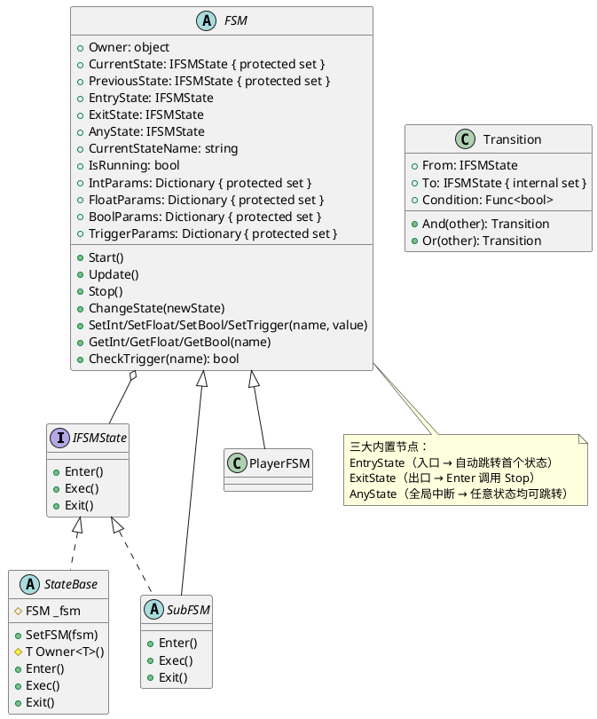
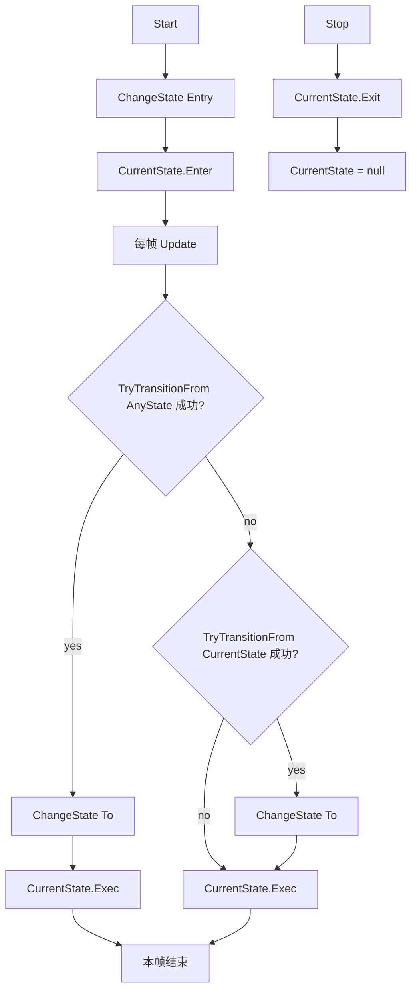

# FSM 状态机模块

轻量级有限状态机，支持分层子状态机（SubFSM）、参数驱动转换、Any State 跳转。

---

## 1. 架构概览

### 1.1 类图



### 1.2 执行流程



---

## 2. 快速开始

### 2.1 定义状态

继承 `StateBase`：

```csharp
public class PlayerIdleState : StateBase
{
    public override void Enter()
    {
        Debug.Log($"{Owner<Player>().name} 进入待机");
    }

    public override void Exec()
    {
        // 每帧检查参数驱动跳转
    }

    public override void Exit()
    {
        Debug.Log($"{Owner<Player>().name} 离开待机");
    }
}
```

### 2.2 定义状态机

继承 `FSM`，覆盖 `OnSetup` 添加状态和转换：

```csharp
public class PlayerFSM : FSM
{
    public PlayerFSM(Player player) : base(player) { }

    protected override void OnSetup()
    {
        AddBool("isMoving", false);
        AddTrigger("attack");

        AddState(new PlayerIdleState());
        AddState(new PlayerMoveState());
        AddState(new PlayerAttackState());

        AddTransition(EntryState, GetState("PlayerIdleState"), () => true);
        AddTransition(GetState("PlayerIdleState"), GetState("PlayerMoveState"),
            () => GetBool("isMoving"));
        AddTransition(GetState("PlayerMoveState"), GetState("PlayerIdleState"),
            () => !GetBool("isMoving"));
        AddAnyTransition(GetState("PlayerAttackState"),
            () => CheckTrigger("attack"));
    }
}
```

### 2.3 外部驱动

```csharp
PlayerFSM fsm = new PlayerFSM(player);
fsm.Start();

void Update()
{
    fsm.SetBool("isMoving", Input.GetKey(KeyCode.W));
    fsm.SetTrigger("attack");
    fsm.Update();
}
```

---

## 3. 状态接口 — `IFSMState`

| 方法 | 调用时机 | 用途 |
|------|----------|------|
| `Enter()` | 状态被激活时 | 初始化、播放动画 |
| `Exec()` | 每帧 Update | 持续行为 |
| `Exit()` | 状态退出时 | 清理、停止动画 |

---

## 4. 状态基类 — `StateBase`

| 成员 | 类型 | 说明 |
|------|------|------|
| `_fsm` | `protected FSM` | 所属状态机引用（AddState 时自动注入） |
| `Owner<T>()` | `protected T` | 泛型获取持有者对象 |

```csharp
public class AttackState : StateBase
{
    public override void Enter()
    {
        Player player = Owner<Player>();
        player.PlayAnimation("Attack");
    }
}
```

---

## 5. 转换条件 — `Transition`

### 5.1 基础用法

```csharp
AddTransition(from, to, () => GetBool("isMoving"));
```

### 5.2 组合条件

```csharp
// And：同时满足
AddTransition(from, to, () => GetBool("isMoving"))
    .And(() => GetFloat("distance") > 5f);

// Or：满足任一
AddTransition(from, to, () => GetBool("isDead"))
    .Or(() => GetBool("forceExit"));
```

### 5.3 Any State

从任意状态都可触发，适合全局中断：

```csharp
AddAnyTransition(GetState("HurtState"), () => GetBool("isHurt"));
```

---

## 6. FSM API 参考

### 6.1 公开 API（外部调用）

| 方法 | 说明 |
|------|------|
| `Start()` | 启动，从 Entry 自动跳转首个状态 |
| `Update()` | 每帧：Any 转换成功则跳转+Exec+结束；否则检查当前转换 → Exec |
| `Stop()` | 停止 |
| `ChangeState(state)` | 切换到指定状态 |

| 属性 | 类型 | 说明 |
|------|------|------|
| `Owner` | `object` | 持有者对象 |
| `CurrentState` | `IFSMState` | 当前状态实例 |
| `PreviousState` | `IFSMState` | 上一个状态 |
| `CurrentStateName` | `string` | 当前状态的类型名 |
| `IsRunning` | `bool` | 是否在运行 |

| 参数方法 | 说明 |
|------|------|
| `SetInt(name, value)` | 设置整数 |
| `GetInt(name)` | 获取整数，不存在返回 0 |
| `SetFloat(name, value)` | 设置浮点数 |
| `GetFloat(name)` | 获取浮点数，不存在返回 0f |
| `SetBool(name, value)` | 设置布尔 |
| `GetBool(name)` | 获取布尔，不存在返回 false |
| `SetTrigger(name)` | 设置触发器 |
| `CheckTrigger(name)` | 检查触发器，满足后**自动重置** |

### 6.2 保护 API（子类 OnSetup 内使用）

| 方法 | 说明 |
|------|------|
| `OnSetup()` | 抽象方法，配置状态和转换 |
| `AddState(state)` | 注册状态，按类型名索引，自动注入 _fsm |
| `GetState(name)` | 按类型名查找状态，不存在返回 null |
| `AddTransition(from, to, condition)` | 添加转换条件 |
| `AddAnyTransition(to, condition)` | 添加全局转换 |

| 参数方法 | 说明 |
|------|------|
| `AddInt(name, value)` | 声明整数参数 |
| `AddFloat(name, value)` | 声明浮点参数 |
| `AddBool(name, value)` | 声明布尔参数 |
| `AddTrigger(name)` | 声明触发器参数 |
| `RemoveInt(name)` | 删除整数参数 |
| `RemoveFloat(name)` | 删除浮点参数 |
| `RemoveBool(name)` | 删除布尔参数 |
| `RemoveTrigger(name)` | 删除触发器参数 |

### 6.3 内置状态节点

| 节点 | 说明 |
|------|------|
| `EntryState` | 入口，Enter 为空，Exec 为空 |
| `ExitState` | 出口，Enter 调用 Stop |
| `AnyState` | 全局，Exec 为空 |

---

## 7. 子状态机 — `SubFSM`

SubFSM 继承 FSM 实现 IFSMState，可作为状态嵌入父 FSM。

**关键特性：**

- 共享父的参数字典（Enter 时复制引用）
- 进入时记录父的 `PreviousState` 作为返回目标
- 退出时自动通知父切换回该目标状态

### 7.1 流程图

```mermaid
flowchart TB
    subgraph 父FSM
        PIdle["IdleState"]
        PCombat["CombatSubFSM"]
        PIdle -->|"inCombat"| PCombat
    end

    subgraph CombatSubFSM
        CIdle["SubIdleState"]
        CAttack["SubAttackState"]
        CIdle -->|"isAttacking"| CAttack
        CAttack -->|"exitCombat"| CIdle
    end

    PCombat -->|"Exit| PIdle"]
```

### 7.2 用法

```csharp
// 父状态机
public class PlayerFSM : FSM
{
    protected override void OnSetup()
    {
        AddState(new PlayerIdleState());
        AddState(new CombatSubFSM(this));

        AddTransition(EntryState, GetState("PlayerIdleState"), () => true);
        AddTransition(GetState("PlayerIdleState"), GetState("CombatSubFSM"),
            () => GetBool("inCombat"));
    }
}

// 子状态机
public class CombatSubFSM : SubFSM
{
    public CombatSubFSM(FSM parent) : base(parent) { }

    protected override void OnSetup()
    {
        AddState(new SubIdleState());
        AddState(new SubAttackState());

        AddTransition(EntryState, GetState("SubIdleState"), () => true);
        AddTransition(GetState("SubIdleState"), GetState("SubAttackState"),
            () => GetBool("isAttacking"));
        AddTransition(GetState("SubAttackState"), GetState("SubIdleState"),
            () => GetBool("exitCombat"));
    }
}
```

### 7.3 适用场景

- 玩家状态机中的"战斗子状态机"
- 敌人 AI 中的"移动子状态机"
- 状态不多时不必强行分层

---

## 8. 完整示例

```csharp
public class Player
{
    private readonly PlayerFSM _fsm;

    public Player()
    {
        _fsm = new PlayerFSM(this);
        _fsm.Start();
    }

    public void Update()
    {
        _fsm.SetBool("isMoving", Input.GetKey(KeyCode.W));
        _fsm.SetTrigger("attack");
        _fsm.Update();
    }
}

public class PlayerFSM : FSM
{
    public PlayerFSM(Player player) : base(player) { }

    protected override void OnSetup()
    {
        AddBool("isMoving", false);
        AddTrigger("attack");
        AddBool("inCombat", false);

        AddState(new PlayerIdleState());
        AddState(new PlayerMoveState());
        AddState(new CombatSubFSM(this));

        AddTransition(EntryState, GetState("PlayerIdleState"), () => true);
        AddTransition(GetState("PlayerIdleState"), GetState("PlayerMoveState"),
            () => GetBool("isMoving"));
        AddTransition(GetState("PlayerMoveState"), GetState("PlayerIdleState"),
            () => !GetBool("isMoving"));
        AddTransition(GetState("PlayerIdleState"), GetState("CombatSubFSM"),
            () => GetBool("inCombat"));
    }
}
```

---

## 9. 最佳实践

1. **继承 FSM**，覆盖 `OnSetup` 配置，不在外部动态添加
2. **参数驱动跳转**，不在 `Exec` 里直接 `ChangeState`
3. **全局中断用 Any State**（受击、死亡）
4. **`Owner<T>()` 获取持有者**，不强制转换
5. **子状态机按需使用**，状态不多时不必强行分层
6. **Trigger 适用于一次性事件**，`CheckTrigger` 帧末自动消费不会重复触发
7. **参数须先声明再使用**，`AddXxx` 在 OnSetup 中声明，`SetXxx/GetXxx` 供外部/状态内部调用
